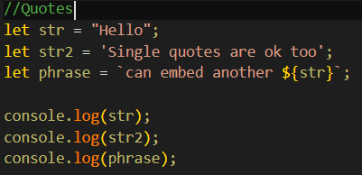

String

* A textual data stored as strings
* There is no separate type for single character.

Quotes

* A string in JavaScript must be surrounded by quotes.
* In JavaScript, there are 3 types of quotes.

  1. Double quotes: "Hello".
  2. Single quotes: 'Hello'.
  3. Backticks: `Hello`.

  
* Double and single quotes are “simple” quotes. There’s practically no difference between them in JavaScript.
* Backticks are “extended functionality” quotes. They allow us to embed variables and expressions
  into a string by wrapping them in ${…}, for example:
* embed variables
* embed an expression
* The expression inside ${…} is evaluated and the result becomes a part of the string. We can put anything in there: a variable like name or an arithmetical expression like 1 + 2 or something more complex.
* Please note that this can only be done in backticks. Other quotes don’t have this embedding functionality!
* Another advantage of using backticks is that they allow
  a string to span multiple lines:
* But single or double quotes do not work this way.
* If we use them and try to use multiple lines, there’ll
  be an error:

Single and double quotes come from ancient times of language
creation, when the need for multiline strings was not taken into account.
Backticks appeared much later and thus are more versatile.

Backticks also allow us to specify a “template function” before
the first backtick. The syntax is: func `string`. The
function func is called automatically, receives the string and
embedded expressions and can process them. This is called “tagged templates”.

Special characters

It is still possible to create multiline strings with single and
double quotes by using a so-called “newline character”, written as \n,
which denotes a line break:

For example, these two lines are equal, just written
differently:

New line In Windows text files a combination of two characters \ represents a new break, while on non-
Wndows OS it'sjust . That's for historical reasons, most Windows software also understands \n .
Quotes
Backslash
Tab
Backspace, Form Feed, Vertical Tab — kept for compatibility, not used nowadays.
Unicode character With the given hexadecimal Unicode XX , e.g. ' \X7A' is the same as 'z' .
A Unicode symbol with the hex code XXXX in UTF-16 encoding for instance \ueøA9 —is a Unicode for the
copyright symbol @ . It must be exactly 4 hex digits.
A Unicode symbol with the given UTF-32 encoding. Some rare characters are encoded with two Unicode
symbols, taking 4 bytes This way we can insert long codes. ]()

Examples with Unicode:

* All special characters start
  with a backslash character \. It is also called an “escape
  character”.
* We might also use it if we
  wanted to insert a quote into the string.

For instance:

* The inner quote by the backslash \', because
  otherwise it would indicate the string end.

Of course, only the quotes that are the same as the enclosing
ones need to be escaped. So, as a more elegant solution, we could switch to
double quotes or backticks instead:

Note that the backslash \ serves for the correct
reading of the string by JavaScript, then disappears. The in-memory string has
no \. You can clearly see that in alert from the examples above.

But what if we need to show an actual
backslash \ within the string?

That’s possible, but we need to double it like \\:

**String length**

The length property has the string length:

Note that \n is a single “special” character, so the
length is indeed 3.
